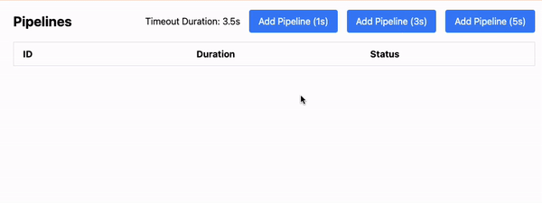

## Getting Started

You are building Pipelines Manager. Components are in place, we need to integrate business logic.

## Requirements

1. **Sequential IDs:** Each pipeline should have a unique ID, incremented sequentially, starting from 1.
2. **Pipeline States:**
Each pipeline can be in one of the following states:
   - QUEUE: The pipeline is waiting to be executed.
   - IN_PROGRESS: The pipeline is currently being executed.
   - COMPLETED: The pipeline has been successfully completed.
   - TIMEOUT: The pipeline execution took longer than the allowed time and timed out.
3. **Immediate Execution:** If no other pipeline is in the queue or being processed, the newly added pipeline should start executing immediately.
4. **Sequential Execution:** Pipelines must be executed one at a time. Once a pipeline completes (or times out), the next pipeline in the queue should start execution automatically.
5. **Timeout & Retry Handling:** If a pipeline execution exceeds the props.timeoutDuration, it should be retried. If it continues to exceed the timeout limit after retrying, its status should be updated to TIMEOUT and execution should move to the next pipeline.
6. **TaskScheduler Integration:** You will need to integrate the existing TaskScheduler class to manage the pipeline execution. This class already handles tasks like timeouts and retries. **Do not modify the TaskScheduler class**, as it is used in other parts of the codebase.

## Submission Instructions

1. Clicking "Run code" will compile and run your code against sample tests, but it will not generate scores. Click on "Execution Log" to better understand the test execution.
2. Clicking "Submit code" will run your code against multiple test cases, assessing different scenarios holistically. The score will be assigned accordingly.

To access the instructions, click on the "Question" button which can be found in the bottom left corner of the screen.
